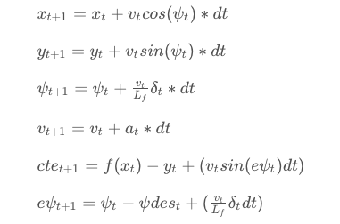

## Implementation

### The Model

The Model state references:
* x & y, the car co-ordinates
* psi, the orientaton angle
* v, velocity
* cte, cross-track error
* epsi, psi error

The Actuator outputs are:
* steering angle
* throttle

The state of the current timestep is calculated using the following update equations, based on the previous timestep state.

(Image Source: Udacity SDC ND, Lesson 20.9 MPC)

### Timestep Length and Elapsed Duration (N & dt)

I began mimicking the timestep and elapsed duration values implemented in the solution to the Mind The Line
problem posed in MPC Lesson 8, namely N = 25 and dt = 0.05 however this proved erratic and the car drove 
almost immediately off the track. A series of decreasing value iterations led to N = 15 and dt = 0.1 as the 
first combination I got to traverse the entire track. Tuning N = 10 and dt = 0.1 led to a smoother 
lap, holding the racing line. 

### Polynomial Fitting and MPC Preprocessing

The waypoint co-ordinates from the simulator were converted to the vehicle's co-ordinate system and a polyfit()
function used to plot the desired route to travel. The cross-track error is then calculated using a polynomial function, polyeval() and the orientation error from the derivative of the polynomial fit line. 

### Model Predictive Control with Latency

The application onMessage() event mimics real-world latency by introducing a sleep_for() delay of 100ms.
Vehicle model update equations referenced above are used to predict where the car will be after 100ms and this
predicted state together with the polyfitted co-efficients are passed to the solve method 
- mpc.Solve(state, coeffs) .

---
